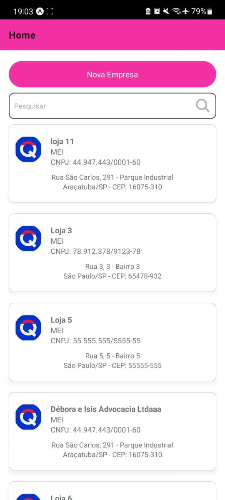
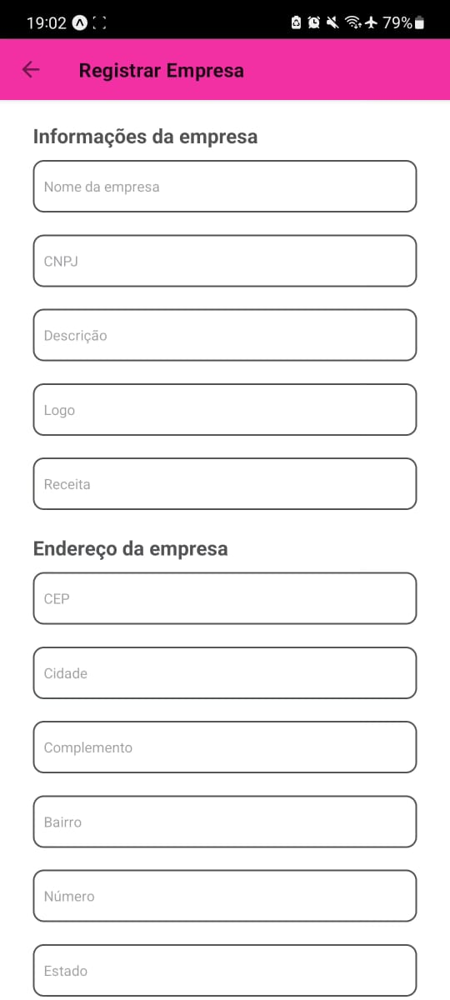
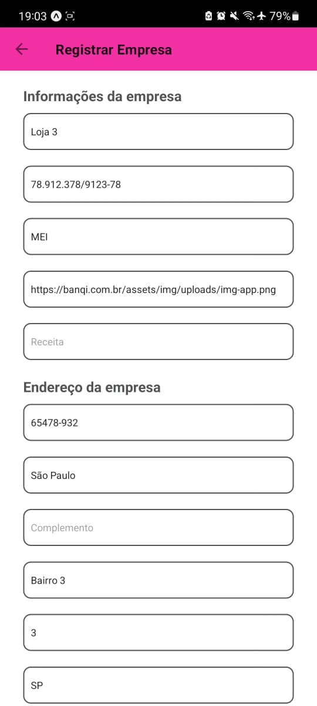
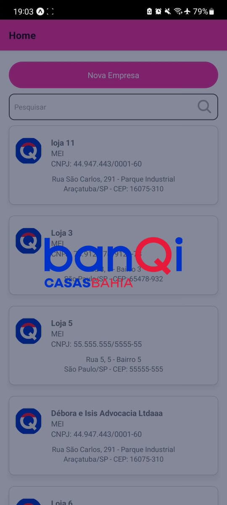
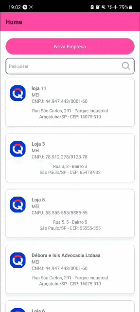

# BanQi
Desafio BanQi

# Sua maquina vai precisar dos requisitos a seguir para rodar esse projeto:
1. node v. 12.0.0 ou superior 
1. yarn

# Passos para instalação:

```shell
git clone
```
```shell
yarn install
```

# Executando seu aplicativo em um simulador ou dispositivo virtual


Para rodar seu aplicativo no iOS Simulator basta 
```shell
yarn ios
```
Para dispositivo android 
```shell
yarn android
```
O Expo CLI permite que você execute seu aplicativo React Native em um dispositivo físico sem configurar um ambiente de desenvolvimento.<br/>
Basta instalar o APP do expo tanto no seu dispositivo movel com sistema ios ou android, abrir o APP, clicar em 'Scan QR Code' e apontar para o QR code mostrado no navegador quando executar o comando: 
```shell
yarn start
```

Caso você não queira rodar o projeto com o expo, você precisará "ejetar" o projeto
```shell
yarn eject
```

## Se ainda possui alguma dúvida, ou teve dificuldades em rodar o projeto, acesse: https://reactnative.dev/docs/environment-setup

<br/>

# Testes

O projeto possui alguns testes, ao qual podem ser executados via:
```shell
yarn test
```

<br/>

# Tecnologias, framework e bibliotecas usadas no projeto
* Javascript
* Typescript
* Styled-Component
* Redux
* React Native
* testing-library
* axios
* yup

# Telas do projeto








